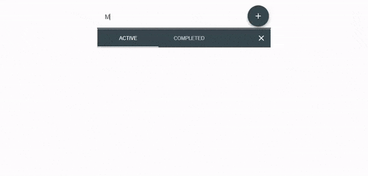

# Todo App

I made a todo app with help from some tutorials, it is not the best it can be improved.

## Live demo

I made a [live demo](https://craques.github.io/todo-app) of the app, the code is the one in this repo

## These are the resources I used to make it 

### React
Introduction to react by Kent C Odds, [available here](https://egghead.io/courses/the-beginner-s-guide-to-react)

### Redux
Tutorial of how to use redux from the author of the library, [available here](https://egghead.io/courses/getting-started-with-redux)

### Material-UI

Youtube tutorial of Material-ui, [available here](https://www.youtube.com/playlist?list=PLcCp4mjO-z98WAu4sd0eVha1g-NMfzHZk)

### Paid Courses
I think the best course is done by Andrew Mead on udemy, starts from scratch walking you through the basics of react and redux, [available here](https://www.udemy.com/react-2nd-edition/)